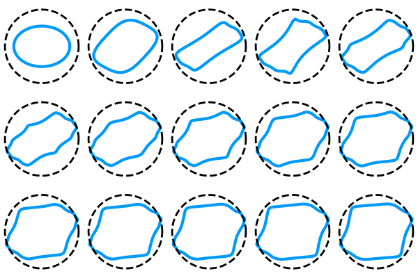

# Switch On Safety (SOS)

| **Documentation** | **Build Status** | **Zenodo** |
|:-----------------:|:----------------:|:----------------------:|
| [![][docs-stable-img]][docs-stable-url] | [![Build Status][build-img]][build-url] | [![DOI][zenodo-img]][zenodo-url] |
| [![][docs-latest-img]][docs-latest-url] | [![Codecov branch][codecov-img]][codecov-url] | |

[](https://github.com/blegat/SwitchOnSafety.jl/blob/master/examples/Finiteness_conjecture_counterexample.ipynb)

This packages implements methods for computing invariant sets using [Sum Of Squares Programming](https://github.com/JuliaOpt/SumOfSquares.jl).
It supports:
* Systems defined in [MathematicalSystems.jl](https://github.com/JuliaReach/MathematicalSystems.jl).
* Hybrid Systems defined in [HybridSystems.jl](https://github.com/blegat/HybridSystems.jl).

It also includes utilities for approximation the [Joint Spectral Radius](https://link.springer.com/book/10.1007%2F978-3-540-95980-9).

## Installation

The package currently requires Julia v1.0, you can download it [here](https://julialang.org/downloads/).
Once Julia is installed, simply launch the REPL an type
```julia
] add SwitchOnSafety
```

## Examples

Example notebooks are available in the [`examples` folder](https://github.com/blegat/SwitchOnSafety.jl/tree/master/examples).
We link them below with the literature.

### Reproducing

The linked notebooks reproduce the results of the following papers:

* [LTJ18] B. Legat, P. Tabuada, R. M. Jungers.
[Computing controlled invariant sets for hybrid systems with applications to model-predictive control](https://www.sciencedirect.com/science/article/pii/S2405896318311480),
IFAC-PapersOnLine, Volume 51, Issue 16, **2018**, Pages 193-198, ISSN 2405-8963,
[https://doi.org/10.1016/j.ifacol.2018.08.033](https://doi.org/10.1016/j.ifacol.2018.08.033):
[Figure 4 and 5](https://github.com/blegat/SwitchOnSafety.jl/blob/master/examples/cruise_control.ipynb),
[Figure 6](https://github.com/blegat/SwitchOnSafety.jl/blob/master/examples/model_predictive_control.ipynb).
* [LJP17] B. Legat, R. M. Jungers, and P. A. Parrilo.
[Certifying unstability of Switched Systems using Sum of Squares Programming](https://arxiv.org/abs/1710.01814),
arXiv preprint arXiv:1710.01814, **2017**:
[running example](https://github.com/blegat/SwitchOnSafety.jl/blob/master/examples/LPJ17.ipynb),
[Example 4.3](https://github.com/blegat/SwitchOnSafety.jl/blob/master/examples/LPJ17e43.ipynb).

### Exploring

The linked notebooks explores the examples of the following papers using this
package:

* [AJPR14] A. Ahmadi, R. Jungers, P. Parrilo and M. Roozbehani,
*Joint spectral radius and path-complete graph Lyapunov functions.*
SIAM J. CONTROL OPTIM 52(1), 687-717, **2014**:
[Example 5.4](https://blegat.github.io/SwitchOnSafety.jl/latest/generated/AJPR14e54/).
* [AP12] A. Ahmadi, and P. Parrilo
*Joint spectral radius of rank one matrices and the maximum cycle mean problem.*
CDC, 731-733, **2012**:
[Example 2.1](https://blegat.github.io/SwitchOnSafety.jl/latest/generated/AP12e21/).
* [AS98] Ando, T. and Shih, M.-h.
*Simultaneous Contractibility*.
SIAM Journal on Matrix Analysis & Applications, **1998**, 19, 487:
[construction](https://github.com/blegat/SwitchOnSafety.jl/blob/master/examples/LPJ17e43.ipynb).
* [BTV03] V. D. Blondel, J. Theys and A. A. Vladimirov.
*An elementary counterexample to the finiteness conjecture*,
SIAM Journal on Matrix Analysis and Applications, **2003**. 24, 963-970:
[the counterexample](https://github.com/blegat/SwitchOnSafety.jl/blob/master/examples/Finiteness_conjecture_counterexample.ipynb).
* [GZ05] N. Guglielmi and M. Zennaro.
*Polytope norms and related algorithms for the computation of the joint spectral radius*.
44th IEEE Conference on Decision and Control, and European Control Conference, **2005**, pp. 3007-3012:
[Section V](https://github.com/blegat/SwitchOnSafety.jl/blob/master/examples/Finiteness_conjecture_counterexample.ipynb).
* [GZ08] N. Guglielmi and M. Zennaro.
*An algorithm for finding extremal polytope norms of matrix families*.
Linear Algebra and its Applications, **2008**, 428(10), 2265-2282:
[Section 5](https://github.com/blegat/SwitchOnSafety.jl/blob/master/examples/Finiteness_conjecture_counterexample.ipynb).
* [GP13] N. Guglielmi and V. Protasov.
*Exact computation of joint spectral characteristics of linear operators*.
Foundations of Computational Mathematics 13.1, **2013**, 37-97.
[Example 1](https://github.com/blegat/SwitchOnSafety.jl/blob/master/examples/Finiteness_conjecture_counterexample.ipynb).
[Example 2](https://github.com/blegat/SwitchOnSafety.jl/blob/master/examples/Finiteness_conjecture_counterexample.ipynb).
* [HMST11] K. G. Hare, I. D Morris, N. Sidorov and J. Theys,
*An explicit counterexample to the Lagarias–Wang finiteness conjecture*.
Advances in Mathematics, **2011**, 226(6), 4667-4701:
[the counterexample](https://github.com/blegat/SwitchOnSafety.jl/blob/master/examples/Finiteness_conjecture_counterexample.ipynb).
* [JCG14] R. Jungers, A. Cicone and N. Guglielmi,
*Lifted polytope methods for computing the joint spectral radius.*
SIAM Journal on Matrix Analysis and Applications, SIAM, **2014**, 35, 391-410:
[Example 6.1](https://github.com/blegat/SwitchOnSafety.jl/blob/master/examples/JCG14e61.ipynb),
[Example 6.3](https://github.com/blegat/SwitchOnSafety.jl/blob/master/examples/JCG14e63.ipynb).
* [PJ08] P. Parrilo and A. Jadbabaie.
*Approximation of the joint spectral radius using sum of squares*.
Linear Algebra and its Applications, Elsevier, **2008**, 428, 2385-2402:
[Example 2.8](https://github.com/blegat/SwitchOnSafety.jl/blob/master/examples/LPJ17e43.ipynb),
[Example 5.4](https://github.com/blegat/SwitchOnSafety.jl/blob/master/examples/PJ08e54.ipynb).
* [P17] M. Philippe.
*Path-Complete Methods and Analysis of Constrained Switching Systems*
Doctoral dissertation, UCLouvain, **2017**:
[Example 2.50](https://github.com/blegat/SwitchOnSafety.jl/blob/master/examples/LPJ17.ipynb),
[Example 2.52](https://github.com/blegat/SwitchOnSafety.jl/blob/master/examples/Consensus.ipynb).
* [PEDJ16] M. Philippe, R. Essick, G. E. Dullerud and R. M. Jungers.
*Stability of discrete-time switching systems with constrained switching sequences.*
Automatica, 72:242-250, **2016**:
[Section 4](https://github.com/blegat/SwitchOnSafety.jl/blob/master/examples/LPJ17.ipynb),

## How to cite

For the `soslyapb` and `sosbuildsequence` functions, cite:
```bibtex
@Article{legat2020certifying,
  author    = {Legat, Beno\^it and Parrilo, Pablo A. and Jungers, Rapha\"el M.},
  journal   = {{SIAM} Journal on Control and Optimization},
  title     = {Certifying Unstability of Switched Systems Using Sum of Squares Programming},
  year      = {2020},
  month     = jan,
  number    = {4},
  pages     = {2616--2638},
  volume    = {58},
  doi       = {10.1137/18M1173460},
  publisher = {Society for Industrial {\&} Applied Mathematics ({SIAM})},
}
```
and for the lower bound obtained by `soslyapb`, see:
```bibtex
@Article{legat2019entropy,
  author    = {Beno\^it Legat and Pablo A. Parrilo and Rapha\"el M. Jungers},
  title     = {An entropy-based bound for the computational complexity of a switched system},
  journal   = {IEEE Transactions on Automatic Control},
  year      = {2019},
  doi       = {10.1109/TAC.2019.2902625},
  publisher = {IEEE},
}
```

For the `getis` and `fillis!` functions with ellipsoids or polysets, cite:
```bibtex
@InProceedings{legat2018computing,
  author   = {Beno\^it Legat and Paulo Tabuada and Rapha\"el M. Jungers},
  title    = {Computing controlled invariant sets for hybrid systems with applications to model-predictive control},
  year     = {2018},
  volume   = {51},
  number   = {16},
  pages    = {193--198},
  note     = {6th IFAC Conference on Analysis and Design of Hybrid Systems ADHS 2018},
  doi      = {https://doi.org/10.1016/j.ifacol.2018.08.033},
  issn     = {2405-8963},
  journal  = {IFAC-PapersOnLine},
  keywords = {Controller Synthesis, Set Invariance, LMIs, Scalable Methods},
  url      = {http://www.sciencedirect.com/science/article/pii/S2405896318311480},
}
```
or with piecewise semi-ellipsoids, cite:
```bibtex
@Article{legat2020piecewise,
  author    = {Beno{\^\i}t Legat and Sa{\v{s}}a V. Rakovi{\'c} and Rapha{\"e}l M. Jungers},
  journal   = {{IEEE} Control Systems Letters},
  title     = {Piecewise Semi-Ellipsoidal Control Invariant Sets},
  year      = {2021},
  month     = jul,
  number    = {3},
  pages     = {755--760},
  volume    = {5},
  doi       = {10.1109/LCSYS.2020.3005326},
  publisher = {Institute of Electrical and Electronics Engineers ({IEEE})},
}
```

[docs-stable-img]: https://img.shields.io/badge/docs-stable-blue.svg
[docs-latest-img]: https://img.shields.io/badge/docs-latest-blue.svg
[docs-stable-url]: https://blegat.github.io/SwitchOnSafety.jl/stable
[docs-latest-url]: https://blegat.github.io/SwitchOnSafety.jl/latest

[build-img]: https://github.com/blegat/SwitchOnSafety.jl/workflows/CI/badge.svg?branch=master
[build-url]: https://github.com/blegat/SwitchOnSafety.jl/actions?query=workflow%3ACI
[codecov-img]: http://codecov.io/github/blegat/SwitchOnSafety.jl/coverage.svg?branch=master
[codecov-url]: http://codecov.io/github/blegat/SwitchOnSafety.jl?branch=master

[zenodo-url]: https://doi.org/10.5281/zenodo.3234046
[zenodo-img]: https://zenodo.org/badge/DOI/10.5281/zenodo.3234046.svg
